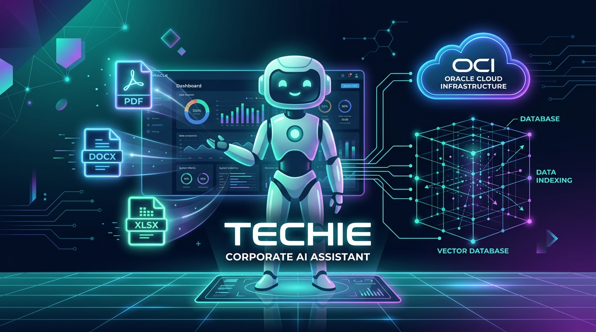
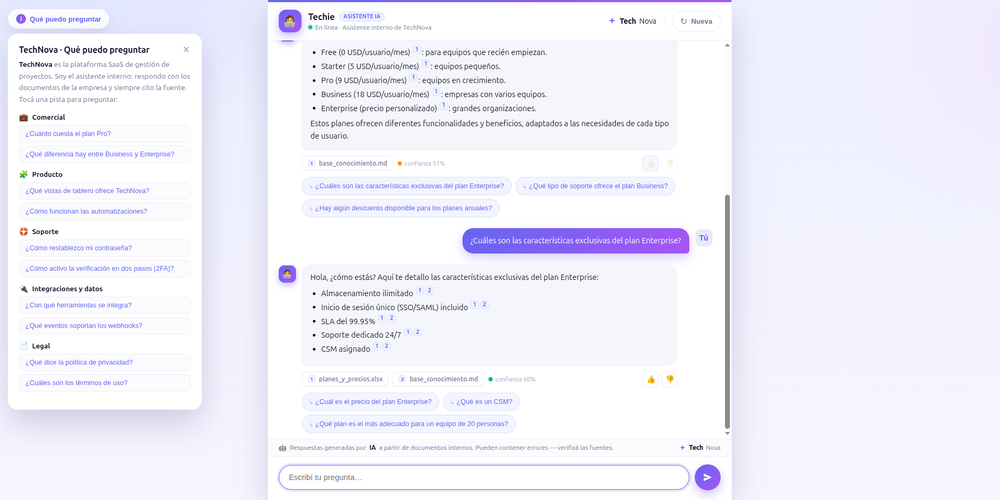
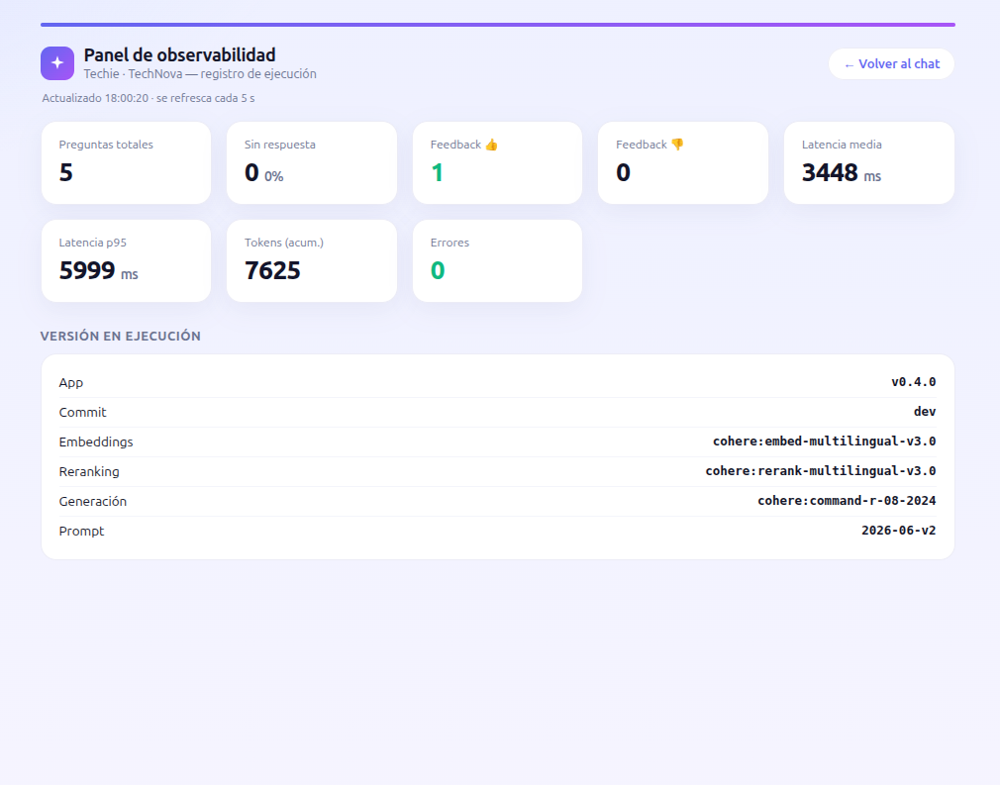
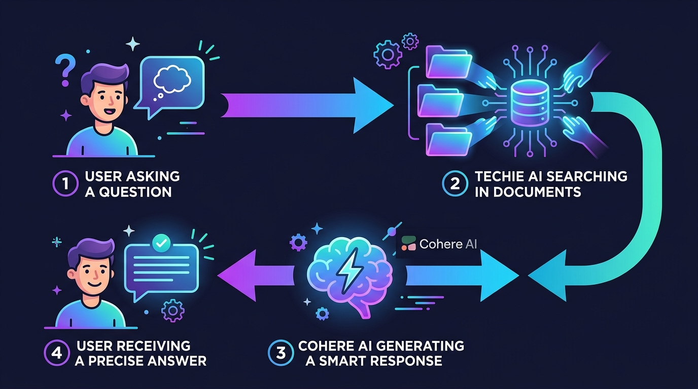
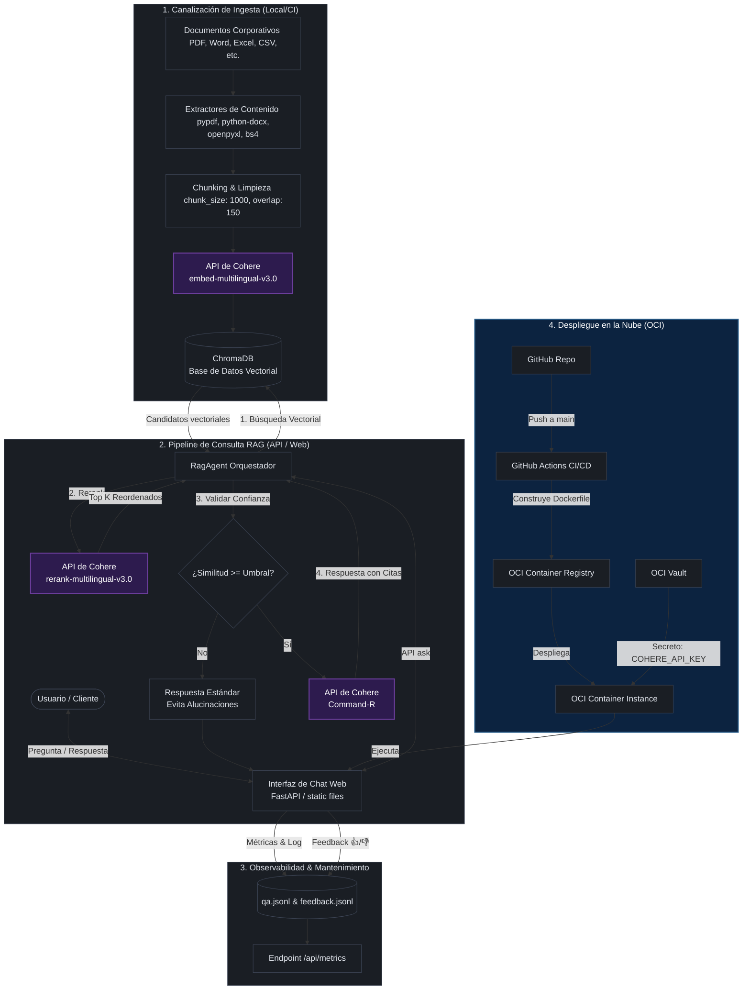

# 🚀 Techie — Agente RAG Corporativo



### Challenge AluraAgente — ONE IA FOR TECH

Este es un agente de Inteligencia Artificial corporativo basado en el patrón **RAG** (Retrieval-Augmented Generation) diseñado para la empresa **TechNova**. Su propósito es responder preguntas de los colaboradores de forma precisa, basándose exclusivamente en los documentos internos de la empresa.

---

### Insignias


---

## 📋 Índice
1. [Descripción del Proyecto](#-descripción-del-proyecto)
2. [Estado del Proyecto](#-estado-del-proyecto)
3. [Demostración de Funciones y Aplicaciones](#-demostración-de-funciones-y-aplicaciones)
4. [Evidencia de Funcionamiento](#-evidencia-de-funcionamiento)
5. [Acceso al Proyecto](#-acceso-al-proyecto)
   - [Prerrequisitos](#prerrequisitos)
   - [Instalación Local](#instalación-local)
   - [Configuración](#configuración)
   - [Ejecución e Ingesta](#ejecución-e-ingesta)
   - [Despliegue con Docker](#despliegue-con-docker)
   - [Despliegue en la Nube (OCI)](#despliegue-en-la-nube-oci)
6. [Tecnologías Utilizadas](#-tecnologías-utilizadas)
   - [Diagrama de Arquitectura y Comunicación](#diagrama-de-arquitectura-y-comunicación)
7. [Personas Contribuyentes](#-personas-contribuyentes)
8. [Personas Desarrolladoras del Proyecto](#-personas-desarrolladoras-del-proyecto)
9. [Licencia](#-licencia)

---

## 📖 Descripción del Proyecto

**Techie** es una solución de IA empresarial diseñada para resolver el problema del acceso fragmentado a la información interna en **TechNova**. Muchas veces, los colaboradores pierden tiempo valioso buscando políticas corporativas, guías de soporte, precios o detalles de integración que están dispersos en múltiples formatos.

Para solucionar esto, **Techie** implementa una arquitectura RAG robusta que:
- **Extrae e Ingiere** contenido desde documentos multiformato en una carpeta local o remota.
- **Indexa Vectorialmente** la información usando embeddings multilingües avanzados.
- **Recupera de Forma Híbrida** (búsqueda vectorial en Chroma + Reranking con Cohere API) los fragmentos más relevantes.
- **Genera Respuestas en Lenguaje Natural** citando rigurosamente las fuentes exactas y controlando la alucinación a través de un umbral de confianza mínimo.
- **Expone un Servidor Web API** con FastAPI para servir una interfaz de chat moderna, rápida e interactiva junto a un panel de métricas para la administración y monitoreo.

El sistema está optimizado para ejecutarse en entornos serverless livianos de **Oracle Cloud Infrastructure (OCI)**, minimizando los costos de infraestructura al no requerir GPUs dedicadas gracias al uso de modelos de lenguaje por API (Cohere).

---

## 🚧 Estado del Proyecto

El proyecto se encuentra en la versión **v0.4.0** y está en **Estado: Listo para Producción**.
- [x] Extracción multiformato (PDF, DOCX, XLSX, PPTX, HTML, CSV, JSON, MD) completada.
- [x] Pipeline de ingesta inteligente con manifest de cambios (`manifest.json`) implementado.
- [x] Indexación vectorial con Chroma DB e integración con API Cohere terminada.
- [x] Reranking con Cohere y filtrado por metadatos (categoría) operativo.
- [x] Interfaz de chat responsiva y panel de métricas implementados.
- [x] Contenerización con Docker y soporte para despliegue en OCI Container Instances probado.
- [x] Logging estructurado de Q&A y feedback de usuarios.

---

## 🌟 Demostración de Funciones y Aplicaciones

El agente **Techie** cuenta con las siguientes capacidades listas para su uso:

*   **Procesamiento de Documentos Multiformato:** Ingiere y analiza de manera transparente archivos `.pdf`, `.docx`, `.xlsx`, `.pptx`, `.html`, `.csv`, `.json` y `.md` depositados en la carpeta `data/documents/`.
*   **Interfaz de Chat Interactiva:**
    *   **Banner de Advertencia de IA:** Aclara permanentemente que las respuestas son generadas de forma automatizada.
    *   **Chips de Citas / Fuentes:** Muestra de qué archivos o URLs se obtuvo la información para que el usuario pueda validarla.
    *   **Indicador de Confianza:** Semáforo visual (verde, amarillo, rojo) según el puntaje de similitud del fragmento de origen.
    *   **Sugerencias Dinámicas:** Ofrece preguntas sugeridas de seguimiento generadas dinámicamente por el LLM o preguntas de arranque.
    *   **Guía Flotante:** Despliega pistas y plantillas de preguntas predeterminadas clasificadas por área corporativa (Comercial, Producto, Soporte, Datos, Legal).
*   **Prevención de Alucinaciones:** Si la similitud máxima del mejor fragmento recuperado es inferior al umbral de seguridad `CONFIDENCE_MIN` (por defecto `0.4`), el agente responde: *"No encontré esa información en los documentos disponibles"* en lugar de alucinar o inventar respuestas.
*   **Mantenimiento y Observabilidad:**
    *   Registra las preguntas y respuestas en `data/logs/qa.jsonl` (incluye latencias, modelos, flags de no respuesta y confianza).
    *   Permite recolectar feedback de los usuarios (👍/👎) en `data/feedback/feedback.jsonl`.
    *   Expone métricas agregadas en tiempo real en `/api/metrics` y visualmente en `/panel`.

---

## 🎥 Evidencia de Funcionamiento

Para verificar el correcto funcionamiento del agente **Techie**, se disponen los siguientes recursos como evidencia en la carpeta `docs/images/`:

### 📺 - Demostración en Video
En el siguiente enlace o reproductor puedes observar al agente interactuando en tiempo real:

[Demostración en Video](https://youtu.be/TrWOPEWfkb4)

> [!NOTE]
> Si el video no se reproduce automáticamente en el visor de GitHub, puedes descargarlo o reproducirlo directamente desde la ruta local [docs/images/demo_funcionamiento.mp4](docs/images/demo_funcionamiento.mp4).

### 📸 Capturas de Pantalla de la Aplicación
A continuación se muestran dos capturas de pantalla clave:

1. **Interfaz del Chat en Ejecución:** Detalle de la conversación donde se visualizan las fuentes citadas, las preguntas sugeridas de seguimiento y el nivel de confianza de la respuesta.
   

2. **Panel de Métricas y Observabilidad:** Vista de la pantalla de métricas de uso y rendimiento para la administración corporativa de la IA.
   

3. **Publicación en Oracle Cloud Infrastructure:** Vista del monitoreo de la instancia donde se deployó la aplicación (en OCI).


---

## 🔑 Acceso al Proyecto

### Prerrequisitos
- Python >= 3.10
- Cuenta en [Cohere](https://dashboard.cohere.com/) para obtener una API Key gratuita o de producción.
- Docker (opcional, para despliegue contenerizado).

### Instalación Local
1. Clona el repositorio:
   ```bash
   git clone https://github.com/gregory-mc/Agente-RAG-AluraChallenge.git
   cd Agente-RAG-AluraChallenge
   ```

2. Crea y activa un entorno virtual de Python:
   ```bash
   python -m venv .venv
   source .venv/bin/activate  # En Windows usa: .venv\Scripts\activate
   ```

3. Instala las dependencias:
   ```bash
   pip install -r requirements.txt
   ```

### Configuración
Copia el archivo de plantilla `.env.example` como `.env`:
```bash
cp .env.example .env
```
Edita `.env` y coloca tu API Key de Cohere:
```env
COHERE_API_KEY=tu_api_key_real_aqui
```

### Ejecución e Ingesta
1. **Colocar documentos:** Agrega tus archivos corporativos en la carpeta `data/documents/` (se proveen algunos archivos de ejemplo de la empresa ficticia TechNova).
2. **Ejecutar Ingesta:** Procesa e indexa los documentos en la base de datos vectorial Chroma DB:
   ```bash
   python -m rag ingest
   ```
   *Nota: La ingesta es inteligente. Si vuelves a correrla, solo reindexará los archivos modificados o nuevos analizando su hash.*

3. **Iniciar Servidor Web:** Arranca la aplicación FastAPI:
   ```bash
   python -m rag serve
   ```
   Abre tu navegador en `http://localhost:8000` para chatear con **Techie**.
   Visita `http://localhost:8000/panel` para ver el panel de métricas.

### Despliegue con Docker
Para correr el proyecto completo de manera aislada en un contenedor Docker local:
```bash
docker compose up --build
```

### Despliegue en la Nube (OCI)
El despliegue está automatizado mediante un pipeline de CI/CD con GitHub Actions (`.github/workflows/deploy-ocir.yml`):
1. **CI/CD:** Cada push a la rama `main` construye la imagen Docker y la sube a **OCI Container Registry (OCIR)**.
2. **Infraestructura:** La imagen se despliega de forma serverless en **OCI Container Instances**.
3. **Seguridad:** La variable `COHERE_API_KEY` se lee de forma segura desde **OCI Vault** sin exponer la clave en el repositorio ni en la imagen.

---

## 🛠️ Tecnologías Utilizadas

- **Lenguaje:** Python >= 3.10
- **Framework Web API:** [FastAPI](https://fastapi.tiangolo.com/) y [Uvicorn](https://www.uvicorn.org/)
- **Base de Datos Vectorial:** [Chroma DB](https://www.trychroma.com/)
- **Procesamiento de LLM & Embeddings:** [Cohere API](https://cohere.com/) (Modelos: `embed-multilingual-v3.0`, `rerank-multilingual-v3.0` y `command-r-08-2024`)
- **Librerías de Extracción:**
  - PDF: `pypdf`
  - Word: `python-docx`
  - Excel: `openpyxl`
  - PowerPoint: `python-pptx`
  - HTML: `beautifulsoup4` + `lxml`
  - Texto plano, JSON, CSV, MD: Nativos de Python
- **Monitoreo:** JSON Lines Logs (observabilidad nativa para cloud aggregators)
- **Contenerización y CI/CD:** Docker, Docker Compose y GitHub Actions
- **Infraestructura Cloud:** Oracle Cloud Infrastructure (OCI Container Registry, OCI Container Instances, OCI Vault, OCI VCN)

---

### Diagrama de Arquitectura y Comunicación

#### Esquema Visual Simplificado
A continuación se presenta una vista simplificada y amigable sobre cómo se procesan las preguntas del usuario y cómo interactúan las tecnologías principales:



#### Esquema Técnico de Flujo (Mermaid)
El siguiente diagrama detalla técnicamente las interacciones de componentes y la comunicación en los entornos local y cloud:



---

## 👥 Personas Contribuyentes

Agradecemos el soporte y los lineamientos proporcionados por los siguientes programas para hacer posible este desarrollo:
*   **Alura Latam**
*   **Oracle Next Education (ONE)**

---

## 📄 Licencia

Este proyecto está bajo la Licencia MIT. Para más detalles, consulta el archivo [LICENSE](LICENSE) (o términos estándar de la licencia MIT).
